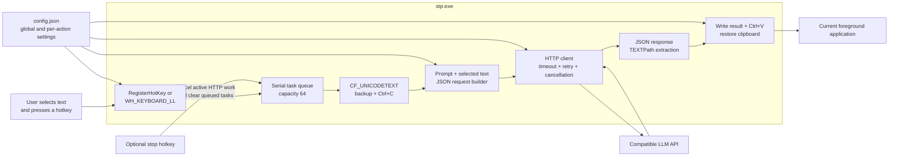
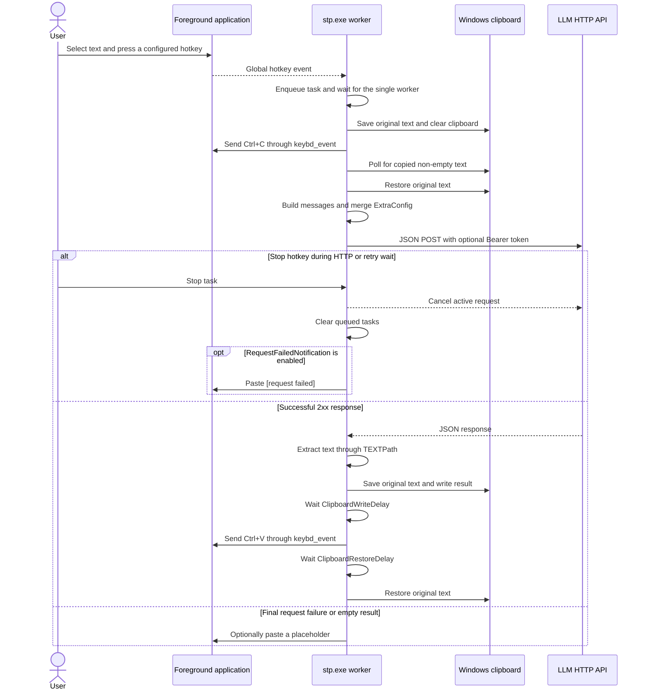

English | [简体中文](README_ZH.md)

# STP for Windows

STP for Windows is a background selected-text processing client for Windows x86_64. It turns configurable global hotkeys into LLM-powered text actions: select text in any application, press a hotkey, and STP copies the selection, sends it to a compatible JSON HTTP API together with the configured prompt, extracts the result, pastes it back, and then attempts to restore the original clipboard text.

stp.exe: a portable command-line background process using native Win32 hotkeys, clipboard APIs, and keyboard events.

## Features

- **Configurable text actions**
  - Define any number of `HotKeyConfig` entries, each with its own prompt, hotkey, and optional request overrides.
  - Typical actions include translation, rewriting, summarization, formatting, extraction, and coding assistance.
- **Two global hotkey backends**
  - Use Windows `RegisterHotKey`, or switch to the `WH_KEYBOARD_LL` low-level keyboard hook.
  - Supports common modifiers, letters, digits, function keys, navigation keys, and numeric keypad aliases.
- **General-purpose LLM JSON API**
  - Sends a JSON `POST` request with a `developer` prompt and the selected text as the `user` message.
  - Supports Bearer tokens, model, temperature, token limits, arbitrary request fields, and configurable response paths.
- **Per-action routing and payload overrides**
  - A hotkey entry can override `APIEndpoint`, `Token`, and `TEXTPath` for that task.
  - Entry-level `ExtraConfig` takes precedence over global `ExtraConfig` and built-in request fields.
- **Serial task queue and cancellation**
  - Processes tasks through a single worker in trigger order, with a queue capacity of 64.
  - An optional stop hotkey cancels the active HTTP request or retry wait and clears queued tasks without exiting STP.
- **Clipboard-preserving replacement**
  - Saves the original Unicode clipboard text, sends `Ctrl+C` and `Ctrl+V` through Win32 `keybd_event`, and attempts to restore the saved text after each operation.
  - Clipboard copy timeout and paste timing can be adjusted for slower applications.
- **Network controls and diagnostics**
  - Supports per-attempt timeout, exponential-backoff retries, HTTP/2 negotiation, TLS verification control, and debug logging.
  - Can paste `[request failed]` or `[empty result]` when placeholder output is enabled.

## Download

| Package | Download | SHA-256 |
|---|---|---|
| Windows x86_64 | [stp-windows-amd64.zip](https://github.com/Joey-Kot/STP-for-Windows/releases/download/Latest/stp-windows-amd64.zip) | [sha256](https://github.com/Joey-Kot/STP-for-Windows/releases/download/Latest/stp-windows-amd64.zip.sha256) |

## Architecture



## Processing flow



STP does not run requests in parallel. Hotkey tasks are processed one at a time in queue order.

## Capabilities and current limitations

- Official releases target Windows x86_64. Clipboard access, keyboard injection, and global hotkeys are Windows-only even though non-Windows builds can compile for testing.
- STP is a console background process. It does not provide a GUI, tray icon, Windows Toast notification, or per-character typing mode.
- The target application must support ordinary `Ctrl+C` and `Ctrl+V` operations and expose copied text through `CF_UNICODETEXT`.
- Only the Unicode text clipboard format is backed up and restored. Images, file lists, rich text, HTML, and other clipboard formats are not preserved.
- The selected text and configured prompt are sent to the API only after the hotkey task reaches the worker. There is no local model or offline processing backend.
- The endpoint must accept JSON and return JSON. Non-JSON responses cannot be extracted.
- Changing the foreground window while a task is running changes where the final `Ctrl+V` is delivered.
- The stop hotkey cancels HTTP requests and retry waits. It does not interrupt a clipboard copy or paste already running.
- Holding a registered hotkey may generate repeated task events. Burst events can be dropped when the hotkey event channel or task queue is full.
- `RequestFailedNotification` is not a Windows notification switch; it controls placeholder text pasted into the foreground application.

## Requirements

- Windows 10 or Windows 11 x86_64.
- A compatible LLM HTTP endpoint that accepts the generated JSON request and returns JSON.
- A target application in which standard `Ctrl+C` and `Ctrl+V` work.

## Quick start

1. Download and extract `stp-windows-amd64.zip`.
2. Open PowerShell in the extracted directory and run:

```powershell
.\stp.exe
```

3. If the current directory has no `config.json` and no command-line override was supplied, STP creates a default `config.json` and exits.
4. Edit the generated file. At minimum, configure the API endpoint and one `HotKeyConfig` entry with both a non-empty `Prompt` and `HotKey`.
5. Start STP again:

```powershell
.\stp.exe --config .\config.json
```

6. Select text in an editor, browser, chat application, or other target window, then press the configured task hotkey.
7. Keep the target input focused until the request finishes. Press `Ctrl+C` in the STP console to exit.

### Minimal configuration example

```json
{
  "APIEndpoint": "https://api.example.com/v1/chat/completions",
  "Token": "sk-xxx",
  "Model": "your-model",
  "TEXTPath": "choices[0].message.content",
  "RequestTimeout": 30,
  "MaxRetry": 3,
  "RetryBaseDelay": 0.5,
  "EnableHTTP2": true,
  "VerifySSL": true,
  "ClipboardTimeout": 1000,
  "ClipboardWriteDelay": 80,
  "ClipboardRestoreDelay": 120,
  "RequestFailedNotification": true,
  "StopTaskHotkey": "alt+f12",
  "HotKeyConfig": [
    {
      "Prompt": "Translate the following text into Simplified Chinese. Return only the translation.",
      "HotKey": "ctrl+f1",
      "ExtraConfig": ""
    },
    {
      "Prompt": "Rewrite the following text to be concise and natural. Return only the rewritten text.",
      "HotKey": "ctrl+f2",
      "ExtraConfig": "{\"temperature\":0.2}"
    }
  ],
  "HotKeyHook": false,
  "DEBUG": false
}
```

This is a protocol example. Use the endpoint, model, token, request fields, and response path required by your provider.

### Run without a visible console window

After validating the configuration in a normal console, STP can be launched hidden from PowerShell:

```powershell
Start-Process `
  -FilePath "C:\Tools\stp\stp.exe" `
  -ArgumentList "--config", "C:\Tools\stp\config.json" `
  -WindowStyle Hidden
```

Use Task Scheduler or your preferred startup mechanism if STP should start automatically after sign-in.

## Configuration lookup and precedence

Configuration precedence is:

```text
Command-line overrides > JSON selected by --config > config.json in the current directory > defaults
```

- When `--config <PATH>` is supplied, STP loads that file and then applies explicit command-line overrides.
- Without `--config`, STP loads `config.json` from the current directory when it exists.
- Without a configuration file, any command-line override starts from the built-in defaults.
- Without a configuration file or command-line override, STP creates a default `config.json`, prints a message, and exits successfully.
- Command-line options do not create `HotKeyConfig` entries or prompts. At least one valid prompt/hotkey pair must still come from the configuration file.
- Missing scalar fields and scalar fields set to `null` keep their defaults. Unknown fields are ignored.
- `HotKeyConfig: null` clears the entry list. A `null` array item becomes an empty entry.
- Invalid JSON or a field with the wrong JSON type is a configuration error.

## Configuration reference

### API and request fields

| Field | Type | Default | Behavior |
|---|---|---:|---|
| `APIEndpoint` | string | `""` | HTTP endpoint used for requests; must be non-empty when a task sends a request |
| `Token` | string | `""` | Sends `Authorization: Bearer <token>` when non-empty |
| `Model` | string | `""` | Adds the root `model` request field when non-empty |
| `Temperature` | number | `0.0` | Adds the root `temperature` field before `ExtraConfig` is merged |
| `Max_Tokens` | integer | `0` | Adds `max_tokens` only when greater than zero |
| `TEXTPath` | string | `"choices[0].message.content"` | Default dot path used to extract the result from the response JSON |
| `ExtraConfig` | string | `""` | Stringified JSON object merged into every request payload |

### Network fields

| Field | Type | Default | Behavior |
|---|---|---:|---|
| `RequestTimeout` | integer | `30` | Timeout in seconds for one complete request attempt; non-positive values disable the explicit timeout |
| `MaxRetry` | integer | `3` | Total request attempts, including the first; values less than one still produce one attempt |
| `RetryBaseDelay` | number | `0.5` | Seconds before the first retry; the delay doubles after each failure; negative or non-finite values are treated as zero |
| `EnableHTTP2` | boolean | `true` | Allows HTTP/2 negotiation when enabled; forces HTTP/1.x when disabled |
| `VerifySSL` | boolean | `true` | Verifies TLS certificates; disabling this accepts invalid certificates |

### Hotkey, clipboard, output, and debug fields

| Field | Type | Default | Behavior |
|---|---|---:|---|
| `ClipboardTimeout` | integer | `1000` | Maximum milliseconds to wait for non-empty copied selection text; negative values become zero |
| `ClipboardWriteDelay` | integer | `80` | Milliseconds to wait after writing processed text and before sending `Ctrl+V`; negative values become zero |
| `ClipboardRestoreDelay` | integer | `120` | Milliseconds to wait after `Ctrl+V` and before restoring the original clipboard text; negative values become zero |
| `RequestFailedNotification` | boolean | `false` | Pastes `[request failed]` after request failure or cancellation and `[empty result]` after empty extraction |
| `StopTaskHotkey` | string | `""` | Optional hotkey that cancels active HTTP work and clears queued tasks |
| `HotKeyConfig` | array | 10 entries | Task definitions; the first eight default hotkeys are `ctrl+f1` through `ctrl+f8`, but every default prompt is empty |
| `HotKeyHook` | boolean | `false` | Uses `WH_KEYBOARD_LL` when true and `RegisterHotKey` when false |
| `DEBUG` | boolean | `false` | Prints request, queue, copy, paste, and other diagnostic errors |

### `HotKeyConfig` entry fields

| Field | Type | Default | Behavior |
|---|---|---:|---|
| `Prompt` | string | `""` | Sent as the `developer` message for this action |
| `HotKey` | string | `""` | Global hotkey that triggers this action |
| `ExtraConfig` | string | `""` | Stringified JSON object merged after global `ExtraConfig`; can also provide task-specific runtime overrides |

Only entries whose `Prompt` and `HotKey` are both non-empty are registered. Task IDs use the entry's one-based position in the array.

## Command-line options

Run the built-in help for the authoritative list:

```powershell
.\stp.exe --help
```

### General

| Option | Purpose |
|---|---|
| `--config <PATH>` | Selects a JSON configuration file |

### API

| Option | Purpose |
|---|---|
| `--api-endpoint <URL>` | Overrides the LLM HTTP endpoint |
| `--token <TOKEN>` | Overrides the Bearer token |
| `--model <MODEL>` | Overrides the model field |
| `--temperature <VALUE>` | Overrides the temperature field |
| `--max-tokens <N>` | Overrides the maximum token field; omitted from the payload when not positive |
| `--text-path <PATH>` | Overrides the response extraction path |
| `--extra-config <JSON>` | Overrides the global stringified extra JSON object |

### Network

| Option | Purpose |
|---|---|
| `--request-timeout <SECONDS>` | Overrides the per-attempt client timeout |
| `--max-retry <N>` | Overrides the total number of request attempts |
| `--retry-base-delay <SECONDS>` | Overrides the initial exponential-backoff delay |
| `--enable-http2 <BOOL>` | Enables or disables HTTP/2 negotiation |
| `--verify-ssl <BOOL>` | Enables or disables TLS certificate verification |

### Hotkeys

| Option | Purpose |
|---|---|
| `--stop-task-hotkey <HOTKEY>` | Overrides the stop hotkey |
| `--hotkey-hook <BOOL>` | Selects the low-level hook or `RegisterHotKey` |
| `--clipboard-timeout <MS>` | Overrides the copied-selection timeout |
| `--clipboard-write-delay <MS>` | Overrides the wait after writing the processed text and before sending `Ctrl+V` |
| `--clipboard-restore-delay <MS>` | Overrides the wait after `Ctrl+V` and before restoring the original clipboard text |

### Output

| Option | Purpose |
|---|---|
| `--request-failed-notification <BOOL>` | Enables or disables failure and empty-result placeholder pasting |

### Debug

| Option | Purpose |
|---|---|
| `--debug <BOOL>` | Enables or disables diagnostic logging |

Use `-h` or `--help` for help and `-V` or `--version` for the version. Long options use the standard double-hyphen form. Boolean options require an explicit value:

```text
--verify-ssl false
--enable-http2=true
--hotkey-hook false
```

Argument parsing failures return exit code `2`. Configuration and runtime failures return `1`. Help, version output, normal shutdown, and initial default configuration creation return `0`.

## Request payload and `ExtraConfig`

For each task, STP first builds this request shape:

```json
{
  "model": "example-model",
  "messages": [
    {
      "role": "developer",
      "content": "<HotKeyConfig.Prompt>"
    },
    {
      "role": "user",
      "content": "<selected text>"
    }
  ],
  "max_tokens": 32768,
  "temperature": 0.0
}
```

`model` is omitted when `Model` is empty, and `max_tokens` is omitted when `Max_Tokens` is not positive. The example values above only illustrate their JSON types.

`ExtraConfig` itself is a JSON string whose decoded value must be an object or `null`:

```json
{
  "ExtraConfig": "{\"max_tokens\":null,\"max_completion_tokens\":32768,\"reasoning_effort\":\"minimal\"}"
}
```

Merge and cleanup rules:

1. Built-in fields are created first.
2. Global `ExtraConfig` overrides built-in fields.
3. The current `HotKeyConfig` entry's `ExtraConfig` overrides both.
4. `null`, whitespace-only strings, and objects or arrays that become empty are removed recursively.
5. Numeric zero and boolean `false` are retained.

This allows provider-specific fields to be added, built-in fields to be replaced, or unwanted fields to be removed with `null`.

An invalid global `ExtraConfig` prevents startup. An invalid entry-level `ExtraConfig` is ignored for that task and is reported only when `DEBUG=true`.

### Per-action runtime overrides

Only entry-level `ExtraConfig` interprets these exact keys as runtime settings:

| Key | Runtime behavior |
|---|---|
| `APIEndpoint` | Uses a different endpoint for this task |
| `Token` | Uses a different Bearer token for this task |
| `TEXTPath` | Uses a different response extraction path for this task |

The values must be strings. These three keys are removed from the request payload after extraction. Empty values fall back to the global configuration. The same keys in global `ExtraConfig` remain ordinary payload fields and do not change runtime routing.

Example:

```json
{
  "Prompt": "Summarize the following text.",
  "HotKey": "ctrl+f3",
  "ExtraConfig": "{\"APIEndpoint\":\"https://api.example.com/v1/chat/completions\",\"Token\":\"task-token\",\"TEXTPath\":\"choices[0].message.content\",\"model\":\"task-model\"}"
}
```

## Response extraction

`TEXTPath` uses dot-separated object keys and supports one or more array indexes on each token:

```text
choices[0].message.content
results[0].alternatives[0].transcript
data.items[0][1].text
```

Strings, numbers, and booleans are converted to text. Objects, arrays, and `null` are not valid final values.

If the configured path does not produce a value, STP tries:

1. The top-level string field `text`.
2. Any non-empty top-level string field.
3. An empty result.

A non-JSON response or an unusable JSON value produces an empty result. When `RequestFailedNotification=true`, STP pastes `[empty result]`; otherwise it remains silent.

## Hotkeys, queue, and stop behavior

Supported modifier aliases:

- `alt`, `menu`
- `ctrl`, `control`
- `shift`
- `win`, `meta`, `super`

Supported main keys include:

- Letters `A`–`Z` and top-row digits `0`–`9`.
- Function keys `F1`–`F24`.
- `Esc`, `Space`, `Enter`, `Tab`, `Backspace`, `Insert`, `Delete`, `Home`, `End`, `PageUp`, and `PageDown`.
- Arrow keys `Left`, `Up`, `Right`, and `Down`.
- Numeric keypad aliases such as `numpad1`, `num1`, `kp1`, `add`, `plus`, `subtract`, and `minus`.

Hotkeys are case-insensitive. For compatibility, unknown modifier tokens before the final main key are ignored; an unsupported final key is an error.

Backend behavior:

- `HotKeyHook=false` uses `RegisterHotKey` on a dedicated Windows message thread.
- `HotKeyHook=true` uses `WH_KEYBOARD_LL`, ignores injected keyboard events, accepts additional held modifiers, and suppresses the matched main key's press and release from reaching other applications.
- Neither backend adds a custom long-press de-duplication layer.

Task behavior:

- The application queue holds at most 64 task IDs and one worker processes them serially.
- When the queue is full, new tasks are dropped instead of blocking the keyboard callback.
- `StopTaskHotkey` cancels the current HTTP request or backoff wait and clears tasks waiting in the application queue.
- When `RequestFailedNotification=true`, canceling an active request follows the request-error path and may paste `[request failed]`.
- The stop action does not exit STP. New task hotkeys continue to work afterward.
- Closing STP cancels active HTTP work, clears the queue, releases registered hotkeys or the hook, and waits for the worker to finish.

## Clipboard and automatic replacement

STP uses only the Windows `CF_UNICODETEXT` clipboard format.

Copy sequence:

1. Read and save the current clipboard text.
2. Try up to five times to replace the clipboard text with an empty string.
3. Wait 50 ms and send `Ctrl+C` through `keybd_event`.
4. Poll every 50 ms for non-empty text until `ClipboardTimeout` expires.
5. Wait 150 ms and try up to five times to restore the original clipboard text.

Paste sequence:

1. Read and save the current clipboard text.
2. Try up to five times to write the processed result.
3. Wait `ClipboardWriteDelay` milliseconds; the default is 80.
4. Send `Ctrl+V` through `keybd_event`.
5. Wait `ClipboardRestoreDelay` milliseconds; the default is 120.
6. Try up to five times to restore the original clipboard text.

Clipboard write retries wait 50 ms between attempts. `OpenClipboard` itself is retried for about one second.

The project deliberately uses `keybd_event` and does not use `SendInput`. Some applications, elevated windows, remote sessions, security software, or clipboard managers may block simulated keys or clipboard access. If replacement is unreliable, increase the clipboard delays and test in a simple application such as Notepad.

## HTTP, retries, and cancellation

- Requests use `POST`, `Content-Type: application/json`, and `User-Agent: clip-hotkey-client/1.0`.
- A non-empty token is sent as `Authorization: Bearer <token>`.
- Any HTTP `2xx` status is treated as success. Other final statuses include the status code and complete response body in the request error.
- `MaxRetry` counts total attempts, not retries after the first attempt.
- Backoff starts at `RetryBaseDelay` and doubles after each failed attempt.
- Request cancellation and retry waits are cooperative and immediate. Clipboard operations are blocking and are not covered by the cancellation token.
- `RequestTimeout` covers one complete attempt, including redirects and response-body reading.
- The client does not use environment or system proxy settings.
- Gzip response decoding is enabled; Brotli and Zstandard are not enabled by default.
- Redirects are handled explicitly. `301`, `302`, and `303` change the request to a bodyless `GET`; `307` and `308` preserve the method and JSON body.
- Authorization is retained only for the original host or its subdomains. Once a redirect leaves that host scope, authorization is removed from the rest of the chain.
- Disabling `EnableHTTP2` forces HTTP/1.x. Enabling it allows normal protocol negotiation.

## Build from source

The project uses Rust Edition 2024. The current stable Rust toolchain is recommended.

### Build on Windows

```powershell
cargo build --locked --release --bin stp
```

Output:

```text
target\release\stp.exe
```

### Cross-compile on Ubuntu

Install the Windows GNU target and MinGW-w64:

```bash
rustup target add x86_64-pc-windows-gnu
sudo apt-get update
sudo apt-get install --yes mingw-w64
```

Build:

```bash
cargo build --locked --release \
  --target x86_64-pc-windows-gnu \
  --bin stp
```

Output:

```text
target/x86_64-pc-windows-gnu/release/stp.exe
```

### Tests and static checks

```bash
cargo fmt --all -- --check
cargo clippy --locked --all-targets -- -D warnings
cargo test --locked --all-targets
cargo clippy --locked \
  --target x86_64-pc-windows-gnu \
  --all-targets -- -D warnings
cargo check --locked \
  --target x86_64-pc-windows-gnu \
  --all-targets
```

GitHub Actions runs these checks, builds `stp.exe`, verifies that the binary does not import `SendInput` or unexpected MinGW runtime DLLs, generates Rust dependency license material, and updates the `Latest` release.

## Security and privacy

- The selected text, prompt, and merged request fields are sent to the configured endpoint. Use only services you trust with that content.
- `Token` and any per-action token are stored as plaintext in `config.json`.
- Keep `VerifySSL=true` for public HTTPS services. Setting it to `false` accepts invalid certificates and can expose requests to man-in-the-middle attacks.
- `DEBUG=true` may print endpoint details and error response bodies containing sensitive content.
- The client bypasses system proxy settings. Configure routing at a trusted gateway or endpoint if a proxy is required.
- Clipboard backup and restoration are best-effort and text-only. Sensitive clipboard text is temporarily held in process memory.
- Automatic paste targets whichever application is in the foreground when the result is ready.

## Implementation constraints

- Hotkeys use `RegisterHotKey` or `WH_KEYBOARD_LL`.
- Clipboard access uses Win32 `CF_UNICODETEXT` APIs.
- Copy and paste use `keybd_event`; `SendInput` is intentionally forbidden.
- Requests are JSON, not multipart or streaming requests.
- Tasks execute through one bounded queue and one worker.
- No GUI, tray integration, Windows notification, local model, or external helper executable is included.

## Repository layout

| Path | Purpose |
|---|---|
| `src/config.rs` | JSON compatibility, defaults, CLI parsing, and override precedence |
| `src/app.rs` | Task queue, worker, cancellation, request orchestration, and placeholder output |
| `src/hotkey/` | Hotkey parsing plus `RegisterHotKey` and low-level hook backends |
| `src/clipboard.rs` | Unicode clipboard copy, paste, retry, and restoration flow |
| `src/keyboard.rs` | `keybd_event`-compatible `Ctrl+C` and `Ctrl+V` simulation |
| `src/request.rs` | Request payload construction and `ExtraConfig` merging |
| `src/response.rs` | `TEXTPath` parsing and response extraction |
| `src/netclient.rs` | HTTP client, redirects, timeout, retry, TLS, and cancellation |
| `tests/` | Cross-platform compatibility and golden-data tests |
| `docs/rust-rewrite-contract.md` | Frozen compatibility contract and Windows manual checks |
| `.github/workflows/latest-release.yml` | Validation, Windows cross-build, packaging, and `Latest` release publication |

## Third-party notices

The Rust dependency graph is locked by `Cargo.lock`. Release archives include generated dependency license details in `THIRD_PARTY_LICENSES/RUST-DEPENDENCIES.html` and the compatibility implementation notice for `micmonay/keybd_event` v1.1.2.

See [THIRD_PARTY_NOTICES.txt](THIRD_PARTY_NOTICES.txt) and [`THIRD_PARTY_LICENSES/`](THIRD_PARTY_LICENSES/) for details.

## License

This project is licensed under the [GNU General Public License v3.0 or later](LICENSE).

Copyright © 2026 Joey Kot <joey.kot.x@gmail.com>
