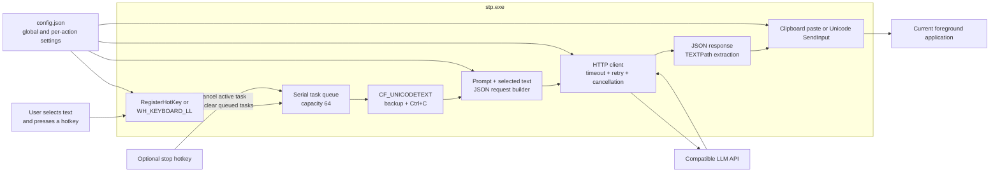
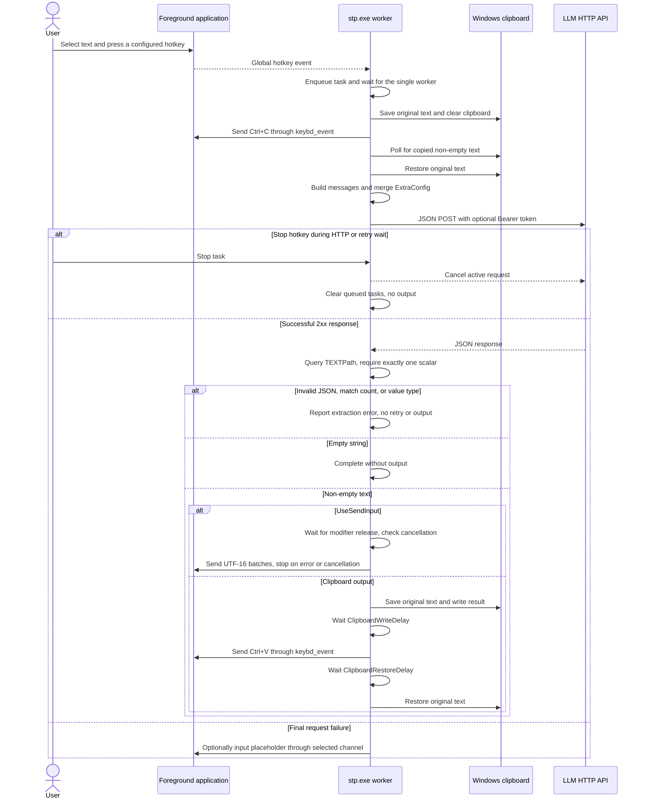

English | [简体中文](README_ZH.md)

# STP for Windows

STP for Windows is a background selected-text processing client for Windows x86_64. It turns configurable global hotkeys into LLM-powered text actions: select text in any application, press a hotkey, and STP copies the selection, sends it to a compatible JSON HTTP API together with the configured prompt, extracts exactly one result using JSONPath, and inputs it through clipboard paste or optional Unicode SendInput. Clipboard operations attempt to restore the original clipboard text.

stp.exe: a portable command-line background process using native Win32 hotkeys, clipboard APIs, and keyboard events.

## Features

- **Configurable text actions**
  - Define any number of `HotKeyConfig` entries, each with its own prompt, hotkey, and optional request overrides.
  - Typical actions include translation, rewriting, summarization, formatting, extraction, and coding assistance.
- **Two global hotkey backends**
  - Use Windows `RegisterHotKey`, or switch to the `WH_KEYBOARD_LL` low-level keyboard hook.
  - Supports common modifiers, letters, digits, function keys, navigation keys, and numeric keypad aliases.
- **General-purpose LLM JSON API**
  - Sends a JSON `POST` request with a `developer` prompt and the selected text as the `user` message.
  - Supports Bearer tokens, model, temperature, token limits, arbitrary request fields, and configurable response paths.
- **Per-action routing and payload overrides**
  - A hotkey entry can override `APIEndpoint`, `Token`, and `TEXTPath` for that task.
  - Entry-level `ExtraConfig` takes precedence over global `ExtraConfig` and built-in request fields.
- **Serial task queue and cancellation**
  - Processes tasks through a single worker in trigger order, with a queue capacity of 64.
  - An optional stop hotkey cancels the active HTTP request, retry wait, or SendInput output and clears queued tasks without exiting STP.
- **Clipboard-preserving replacement**
  - Saves the original Unicode clipboard text, sends `Ctrl+C` and `Ctrl+V` through Win32 `keybd_event`, and attempts to restore the saved text after each operation.
  - Clipboard copy timeout and paste timing can be adjusted for slower applications.
  - Optional `UseSendInput` sends Unicode text without using the clipboard for output. Copying the selection still uses the clipboard.
- **Network controls and diagnostics**
  - Supports per-attempt timeout, exponential-backoff retries, HTTP/2 negotiation, TLS verification control, and debug logging.
  - Can input `[request failed]` after request failure. Extraction errors and empty strings produce no output.

## Download

| Package | Download | SHA-256 |
|---|---|---|
| Windows x86_64 | [stp-windows-amd64.zip](https://github.com/Joey-Kot/STP-for-Windows/releases/download/Latest/stp-windows-amd64.zip) | [sha256](https://github.com/Joey-Kot/STP-for-Windows/releases/download/Latest/stp-windows-amd64.zip.sha256) |

## Architecture


```mermaid
flowchart LR
    User["User selects text<br/>and presses a hotkey"]

    subgraph Process["stp.exe"]
        Hotkeys["RegisterHotKey or<br/>WH_KEYBOARD_LL"]
        Queue["Serial task queue<br/>capacity 64"]
        Copy["CF_UNICODETEXT<br/>backup + Ctrl+C"]
        Build["Prompt + selected text<br/>JSON request builder"]
        HTTP["HTTP client<br/>timeout + retry + cancellation"]
        Extract["JSON response<br/>TEXTPath extraction"]
        Paste["Clipboard paste or Unicode SendInput"]
    end

    Config["config.json<br/>global and per-action settings"]
    API["Compatible LLM API"]
    Target["Current foreground application"]
    Stop["Optional stop hotkey"]

    User --> Hotkeys --> Queue --> Copy --> Build --> HTTP
    HTTP --> API --> HTTP
    HTTP --> Extract --> Paste --> Target
    Config --> Hotkeys
    Config --> Build
    Config --> HTTP
    Config --> Paste
    Stop -->|"cancel active task<br/>and clear queued tasks"| Queue
```

## Processing flow


```mermaid
sequenceDiagram
    actor User
    participant Target as Foreground application
    participant STP as stp.exe worker
    participant Clipboard as Windows clipboard
    participant API as LLM HTTP API

    User->>Target: Select text and press a configured hotkey
    Target-->>STP: Global hotkey event
    STP->>STP: Enqueue task and wait for the single worker
    STP->>Clipboard: Save original text and clear clipboard
    STP->>Target: Send Ctrl+C through keybd_event
    STP->>Clipboard: Poll for copied non-empty text
    STP->>Clipboard: Restore original text
    STP->>STP: Build messages and merge ExtraConfig
    STP->>API: JSON POST with optional Bearer token

    alt Stop hotkey during HTTP or retry wait
        User->>STP: Stop task
        STP-->>API: Cancel active request
        STP->>STP: Clear queued tasks, no output
    else Successful 2xx response
        API-->>STP: JSON response
        STP->>STP: Query TEXTPath, require exactly one scalar
        alt Invalid JSON, match count, or value type
            STP->>STP: Report extraction error, no retry or output
        else Empty string
            STP->>STP: Complete without output
        else Non-empty text
            alt UseSendInput
                STP->>STP: Wait for modifier release, check cancellation
                STP->>Target: Send UTF-16 batches, stop on error or cancellation
            else Clipboard output
                STP->>Clipboard: Save original text and write result
                STP->>STP: Wait ClipboardWriteDelay
                STP->>Target: Send Ctrl+V through keybd_event
                STP->>STP: Wait ClipboardRestoreDelay
                STP->>Clipboard: Restore original text
            end
        end
    else Final request failure
        STP->>Target: Optionally input placeholder through selected channel
    end
```

STP does not run requests in parallel. Hotkey tasks are processed one at a time in queue order.

## Capabilities and current limitations

- Official releases target Windows x86_64. Clipboard access, keyboard injection, and global hotkeys are Windows-only even though non-Windows builds can compile for testing.
- STP is a console background process. It does not provide a GUI, tray icon, or Windows Toast notification.
- The target application must support `Ctrl+C` and expose copied text through `CF_UNICODETEXT`. Output requires `Ctrl+V` support or Unicode SendInput support for the selected channel.
- Only the Unicode text clipboard format is backed up and restored. Images, file lists, rich text, HTML, and other clipboard formats are not preserved.
- The selected text and configured prompt are sent to the API only after the hotkey task reaches the worker. There is no local model or offline processing backend.
- The endpoint must accept JSON and return JSON. Non-JSON responses cannot be extracted.
- Changing the foreground window while a task is running changes where the output is delivered.
- The stop hotkey cancels HTTP requests, retry waits, and SendInput waits or remaining batches. It does not interrupt a clipboard copy or paste already running.
- Holding a registered hotkey may generate repeated task events. Burst events can be dropped when the hotkey event channel or task queue is full.
- `RequestFailedNotification` is not a Windows notification switch; it controls request-failure text output through the selected channel.

## Requirements

- Windows 10 or Windows 11 x86_64.
- A compatible LLM HTTP endpoint that accepts the generated JSON request and returns JSON.
- A target application in which standard `Ctrl+C` and `Ctrl+V` work.

## Quick start

1. Download and extract `stp-windows-amd64.zip`.
2. Open PowerShell in the extracted directory and run:

```powershell
.\stp.exe
```

3. If the current directory has no `config.json` and no command-line override was supplied, STP creates a default `config.json` and exits.
4. Edit the generated file. At minimum, configure the API endpoint and one `HotKeyConfig` entry with both a non-empty `Prompt` and `HotKey`.
5. Start STP again:

```powershell
.\stp.exe --config .\config.json
```

6. Select text in an editor, browser, chat application, or other target window, then press the configured task hotkey.
7. Keep the target input focused until the request finishes. Press `Ctrl+C` in the STP console to exit.

### Minimal configuration example

```json
{
  "APIEndpoint": "https://api.example.com/v1/chat/completions",
  "Token": "sk-xxx",
  "Model": "your-model",
  "TEXTPath": "$.choices[0].message.content",
  "RequestTimeout": 30,
  "MaxRetry": 3,
  "RetryBaseDelay": 0.5,
  "EnableHTTP2": true,
  "VerifySSL": true,
  "ClipboardTimeout": 1000,
  "ClipboardWriteDelay": 80,
  "ClipboardRestoreDelay": 120,
  "UseSendInput": false,
  "RequestFailedNotification": true,
  "StopTaskHotkey": "alt+f12",
  "HotKeyConfig": [
    {
      "Prompt": "Translate the following text into Simplified Chinese. Return only the translation.",
      "HotKey": "ctrl+f1",
      "ExtraConfig": ""
    },
    {
      "Prompt": "Rewrite the following text to be concise and natural. Return only the rewritten text.",
      "HotKey": "ctrl+f2",
      "ExtraConfig": "{\"temperature\":0.2}"
    }
  ],
  "HotKeyHook": false,
  "DEBUG": false
}
```

This is a protocol example. Use the endpoint, model, token, request fields, and response path required by your provider.

### Run without a visible console window

After validating the configuration in a normal console, STP can be launched hidden from PowerShell:

```powershell
Start-Process `
  -FilePath "C:\Tools\stp\stp.exe" `
  -ArgumentList "--config", "C:\Tools\stp\config.json" `
  -WindowStyle Hidden
```

Use Task Scheduler or your preferred startup mechanism if STP should start automatically after sign-in.

## Configuration lookup and precedence

Configuration precedence is:

```text
Command-line overrides > JSON selected by --config > config.json in the current directory > defaults
```

- When `--config <PATH>` is supplied, STP loads that file and then applies explicit command-line overrides.
- Without `--config`, STP loads `config.json` from the current directory when it exists.
- Without a configuration file, any command-line override starts from the built-in defaults.
- Without a configuration file or command-line override, STP creates a default `config.json`, prints a message, and exits successfully.
- Command-line options do not create `HotKeyConfig` entries or prompts. At least one valid prompt/hotkey pair must still come from the configuration file.
- Missing scalar fields and scalar fields set to `null` keep their defaults. Unknown fields are ignored.
- `HotKeyConfig: null` clears the entry list. A `null` array item becomes an empty entry.
- Invalid JSON or a field with the wrong JSON type is a configuration error.

## Configuration reference

### API and request fields

| Field | Type | Default | Behavior |
|---|---|---:|---|
| `APIEndpoint` | string | `""` | HTTP endpoint used for requests; must be non-empty when a task sends a request |
| `Token` | string | `""` | Sends `Authorization: Bearer <token>` when non-empty |
| `Model` | string | `""` | Adds the root `model` request field when non-empty |
| `Temperature` | number | `0.0` | Adds the root `temperature` field before `ExtraConfig` is merged |
| `Max_Tokens` | integer | `0` | Adds `max_tokens` only when greater than zero |
| `TEXTPath` | string | `"$.choices[0].message.content"` | Standard JSONPath selecting exactly one string, number, or boolean from the response |
| `ExtraConfig` | string | `""` | Stringified JSON object merged into every request payload |

### Network fields

| Field | Type | Default | Behavior |
|---|---|---:|---|
| `RequestTimeout` | integer | `30` | Timeout in seconds for one complete request attempt; non-positive values disable the explicit timeout |
| `MaxRetry` | integer | `3` | Total request attempts, including the first; values less than one still produce one attempt |
| `RetryBaseDelay` | number | `0.5` | Seconds before the first retry; the delay doubles after each failure; negative or non-finite values are treated as zero |
| `EnableHTTP2` | boolean | `true` | Allows HTTP/2 negotiation when enabled; forces HTTP/1.x when disabled |
| `VerifySSL` | boolean | `true` | Verifies TLS certificates; disabling this accepts invalid certificates |

### Hotkey, clipboard, output, and debug fields

| Field | Type | Default | Behavior |
|---|---|---:|---|
| `ClipboardTimeout` | integer | `1000` | Maximum milliseconds to wait for non-empty copied selection text; negative values become zero |
| `ClipboardWriteDelay` | integer | `80` | Milliseconds to wait after writing processed text and before sending `Ctrl+V`; negative values become zero |
| `ClipboardRestoreDelay` | integer | `120` | Milliseconds to wait after `Ctrl+V` and before restoring the original clipboard text; negative values become zero |
| `UseSendInput` | boolean | `false` | Outputs Unicode text with SendInput; clipboard write/restore delays do not apply to output |
| `RequestFailedNotification` | boolean | `false` | Inputs `[request failed]` after request failure; cancellation, extraction errors, and empty strings produce no placeholder |
| `StopTaskHotkey` | string | `""` | Optional hotkey that cancels active HTTP/SendInput work and clears queued tasks |
| `HotKeyConfig` | array | 10 entries | Task definitions; the first eight default hotkeys are `ctrl+f1` through `ctrl+f8`, but every default prompt is empty |
| `HotKeyHook` | boolean | `false` | Uses `WH_KEYBOARD_LL` when true and `RegisterHotKey` when false |
| `DEBUG` | boolean | `false` | Prints request, queue, copy, paste, and other diagnostic errors |

### `HotKeyConfig` entry fields

| Field | Type | Default | Behavior |
|---|---|---:|---|
| `Prompt` | string | `""` | Sent as the `developer` message for this action |
| `HotKey` | string | `""` | Global hotkey that triggers this action |
| `ExtraConfig` | string | `""` | Stringified JSON object merged after global `ExtraConfig`; can also provide task-specific runtime overrides |

Only entries whose `Prompt` and `HotKey` are both non-empty are registered. Task IDs use the entry's one-based position in the array.

## Command-line options

Run the built-in help for the authoritative list:

```powershell
.\stp.exe --help
```

### General

| Option | Purpose |
|---|---|
| `--config <PATH>` | Selects a JSON configuration file |

### API

| Option | Purpose |
|---|---|
| `--api-endpoint <URL>` | Overrides the LLM HTTP endpoint |
| `--token <TOKEN>` | Overrides the Bearer token |
| `--model <MODEL>` | Overrides the model field |
| `--temperature <VALUE>` | Overrides the temperature field |
| `--max-tokens <N>` | Overrides the maximum token field; omitted from the payload when not positive |
| `--text-path <PATH>` | Overrides the response extraction path |
| `--extra-config <JSON>` | Overrides the global stringified extra JSON object |

### Network

| Option | Purpose |
|---|---|
| `--request-timeout <SECONDS>` | Overrides the per-attempt client timeout |
| `--max-retry <N>` | Overrides the total number of request attempts |
| `--retry-base-delay <SECONDS>` | Overrides the initial exponential-backoff delay |
| `--enable-http2 <BOOL>` | Enables or disables HTTP/2 negotiation |
| `--verify-ssl <BOOL>` | Enables or disables TLS certificate verification |

### Hotkeys

| Option | Purpose |
|---|---|
| `--stop-task-hotkey <HOTKEY>` | Overrides the stop hotkey |
| `--hotkey-hook <BOOL>` | Selects the low-level hook or `RegisterHotKey` |
| `--clipboard-timeout <MS>` | Overrides the copied-selection timeout |
| `--clipboard-write-delay <MS>` | Overrides the wait after writing the processed text and before sending `Ctrl+V` |
| `--clipboard-restore-delay <MS>` | Overrides the wait after `Ctrl+V` and before restoring the original clipboard text |

### Output

| Option | Purpose |
|---|---|
| `--use-sendinput <BOOL>` | Enables or disables Unicode SendInput; omitting the option preserves the configuration |
| `--request-failed-notification <BOOL>` | Enables or disables request-failure placeholder output |

### Debug

| Option | Purpose |
|---|---|
| `--debug <BOOL>` | Enables or disables diagnostic logging |

Use `-h` or `--help` for help and `-V` or `--version` for the version. Long options use the standard double-hyphen form. Boolean options require an explicit value:

```text
--verify-ssl false
--enable-http2=true
--hotkey-hook false
```

Argument parsing failures return exit code `2`. Configuration and runtime failures return `1`. Help, version output, normal shutdown, and initial default configuration creation return `0`.

## Request payload and `ExtraConfig`

For each task, STP first builds this request shape:

```json
{
  "model": "example-model",
  "messages": [
    {
      "role": "developer",
      "content": "<HotKeyConfig.Prompt>"
    },
    {
      "role": "user",
      "content": "<selected text>"
    }
  ],
  "max_tokens": 32768,
  "temperature": 0.0
}
```

`model` is omitted when `Model` is empty, and `max_tokens` is omitted when `Max_Tokens` is not positive. The example values above only illustrate their JSON types.

`ExtraConfig` itself is a JSON string whose decoded value must be an object or `null`:

```json
{
  "ExtraConfig": "{\"max_tokens\":null,\"max_completion_tokens\":32768,\"reasoning_effort\":\"minimal\"}"
}
```

Merge and cleanup rules:

1. Built-in fields are created first.
2. Global `ExtraConfig` overrides built-in fields.
3. The current `HotKeyConfig` entry's `ExtraConfig` overrides both.
4. `null`, whitespace-only strings, and objects or arrays that become empty are removed recursively.
5. Numeric zero and boolean `false` are retained.

This allows provider-specific fields to be added, built-in fields to be replaced, or unwanted fields to be removed with `null`.

An invalid global `ExtraConfig` prevents startup. An invalid entry-level `ExtraConfig` is ignored for that task and is reported only when `DEBUG=true`.

### Per-action runtime overrides

Only entry-level `ExtraConfig` interprets these exact keys as runtime settings:

| Key | Runtime behavior |
|---|---|
| `APIEndpoint` | Uses a different endpoint for this task |
| `Token` | Uses a different Bearer token for this task |
| `TEXTPath` | Uses a different response extraction path for this task |

The values must be strings. These three keys are removed from the request payload after extraction. Empty values fall back to the global configuration. The same keys in global `ExtraConfig` remain ordinary payload fields and do not change runtime routing.

Example:

```json
{
  "Prompt": "Summarize the following text.",
  "HotKey": "ctrl+f3",
  "ExtraConfig": "{\"APIEndpoint\":\"https://api.example.com/v1/chat/completions\",\"Token\":\"task-token\",\"TEXTPath\":\"$.choices[0].message.content\",\"model\":\"task-model\"}"
}
```

## Response extraction

`TEXTPath` uses standard JSONPath, parsed by `serde_json_path`. The default is `$.choices[0].message.content`. Existing paths such as `choices[0].message.content` must be changed to start with `$`; the old dot-path syntax is no longer accepted.

| Selector | Example |
|---|---|
| Nested fields and arrays | `$.choices[0].message.content` |
| Consecutive array indexes | `$.data.items[0][1].text` |
| Last array element | `$.segments[-1].text` |
| Keys containing dots or spaces | `$['result.text']`, `$['recognition result']['text-value']` |
| Filter | `$.segments[?@.id == 42].text` |
| Wildcard, slice, recursive search | `$.segments[*].text`, `$.segments[0:1].text`, `$..text` |

Global paths and non-empty per-entry overrides are validated at startup, after CLI overrides, and compiled expressions are reused for tasks. A blank per-entry override continues to inherit the global path. An empty global path or invalid expression prevents startup before any request is sent.

Every query must match **exactly one node**. Strings, numbers, and booleans become text; objects, arrays, and `null` are rejected. STP does not take the first match, join matches, or fall back to other fields.

For example, given:

```json
{"segments":[{"id":1,"text":"first"},{"id":42,"text":"last"}]}
```

`$.segments[?@.id == 42].text` returns `last`; `$.segments[*].text` fails with two matches. Appending `[0]` applies to each selected JSON value, not to the query result list.

Invalid JSON, zero matches, multiple matches (including the actual count), and unsupported value types are reported as extraction errors. They do not retry the HTTP request or output a placeholder. With `DEBUG=true`, the original response body is printed for diagnosis. An empty string is a successful result and produces no output, even when `RequestFailedNotification=true`.

## Hotkeys, queue, and stop behavior

Supported modifier aliases:

- `alt`, `menu`
- `ctrl`, `control`
- `shift`
- `win`, `meta`, `super`

Supported main keys include:

- Letters `A`–`Z` and top-row digits `0`–`9`.
- Function keys `F1`–`F24`.
- `Esc`, `Space`, `Enter`, `Tab`, `Backspace`, `Insert`, `Delete`, `Home`, `End`, `PageUp`, and `PageDown`.
- Arrow keys `Left`, `Up`, `Right`, and `Down`.
- Numeric keypad aliases such as `numpad1`, `num1`, `kp1`, `add`, `plus`, `subtract`, and `minus`.

Hotkeys are case-insensitive. For compatibility, unknown modifier tokens before the final main key are ignored; an unsupported final key is an error.

Backend behavior:

- `HotKeyHook=false` uses `RegisterHotKey` on a dedicated Windows message thread.
- `HotKeyHook=true` uses `WH_KEYBOARD_LL`, ignores injected keyboard events, accepts additional held modifiers, and suppresses the matched main key's press and release from reaching other applications.
- Neither backend adds a custom long-press de-duplication layer.

Task behavior:

- The application queue holds at most 64 task IDs and one worker processes them serially.
- When the queue is full, new tasks are dropped instead of blocking the keyboard callback.
- `StopTaskHotkey` cancels the current HTTP request, backoff wait, or SendInput output and clears tasks waiting in the application queue.
- Cancellation does not output a placeholder. Already injected text cannot be recalled.
- The stop action does not exit STP. New task hotkeys continue to work afterward.
- Closing STP cancels active HTTP/SendInput work, clears the queue, releases registered hotkeys or the hook, and waits for the worker to finish.

## Clipboard and automatic replacement

STP uses only the Windows `CF_UNICODETEXT` clipboard format.

Copy sequence:

1. Read and save the current clipboard text.
2. Try up to five times to replace the clipboard text with an empty string.
3. Wait 50 ms and send `Ctrl+C` through `keybd_event`.
4. Poll every 50 ms for non-empty text until `ClipboardTimeout` expires.
5. Wait 150 ms and try up to five times to restore the original clipboard text.

Paste sequence:

1. Read and save the current clipboard text.
2. Try up to five times to write the processed result.
3. Wait `ClipboardWriteDelay` milliseconds; the default is 80.
4. Send `Ctrl+V` through `keybd_event`.
5. Wait `ClipboardRestoreDelay` milliseconds; the default is 120.
6. Try up to five times to restore the original clipboard text.

Clipboard write retries wait 50 ms between attempts. `OpenClipboard` itself is retried for about one second.

With `UseSendInput=true` (or `--use-sendinput true`), output uses `SendInput` and `KEYEVENTF_UNICODE` without reading or writing the clipboard. This includes successful results and request-failure placeholders. Selection copying still follows the clipboard flow above. The two clipboard output delays keep their configured values but do not affect SendInput.

Text is encoded as UTF-16 in batches of at most 128 code units. Surrogate pairs and each key-down/key-up pair remain in the same batch. CRLF and LF become CR; newlines and Tab use Unicode events. Before each batch, STP waits up to two seconds for Ctrl, Shift, Alt, and Win to be released. Waiting and remaining batches can be canceled.

STP checks the number of injected events and reports zero or partial delivery, or cancellation after output has begun. It never switches channels or automatically resends text. A clipboard restore failure after a successful paste is reported separately. Some applications or elevated windows may reject simulated input; SendInput success only confirms event injection, not consumption by the target application.

## HTTP, retries, and cancellation

- Requests use `POST`, `Content-Type: application/json`, and `User-Agent: clip-hotkey-client/1.0`.
- A non-empty token is sent as `Authorization: Bearer <token>`.
- Any HTTP `2xx` status is treated as success. Other final statuses include the status code and complete response body in the request error.
- `MaxRetry` counts total attempts, not retries after the first attempt.
- Backoff starts at `RetryBaseDelay` and doubles after each failed attempt.
- HTTP and retry waits can be canceled, as can SendInput waits and remaining batches. A blocking clipboard operation already running finishes before cancellation takes effect.
- `RequestTimeout` covers one complete attempt, including redirects and response-body reading.
- The client does not use environment or system proxy settings.
- Gzip response decoding is enabled; Brotli and Zstandard are not enabled by default.
- Redirects are handled explicitly. `301`, `302`, and `303` change the request to a bodyless `GET`; `307` and `308` preserve the method and JSON body.
- Authorization is retained only for the original host or its subdomains. Once a redirect leaves that host scope, authorization is removed from the rest of the chain.
- Disabling `EnableHTTP2` forces HTTP/1.x. Enabling it allows normal protocol negotiation.

## Build from source

The project uses Rust Edition 2024. The current stable Rust toolchain is recommended.

### Build on Windows

```powershell
cargo build --locked --release --bin stp
```

Output:

```text
target\release\stp.exe
```

### Cross-compile on Ubuntu

Install the Windows GNU target and MinGW-w64:

```bash
rustup target add x86_64-pc-windows-gnu
sudo apt-get update
sudo apt-get install --yes mingw-w64
```

Build:

```bash
cargo build --locked --release \
  --target x86_64-pc-windows-gnu \
  --bin stp
```

Output:

```text
target/x86_64-pc-windows-gnu/release/stp.exe
```

### Tests and static checks

```bash
cargo fmt --all -- --check
cargo clippy --locked --all-targets -- -D warnings
cargo test --locked --all-targets
cargo clippy --locked \
  --target x86_64-pc-windows-gnu \
  --all-targets -- -D warnings
cargo check --locked \
  --target x86_64-pc-windows-gnu \
  --all-targets
```

GitHub Actions runs these checks, builds `stp.exe`, verifies that the binary imports `keybd_event`, `SendInput`, and `GetAsyncKeyState` and has no unexpected MinGW runtime DLLs, generates Rust dependency license material, and updates the `Latest` release.

## Security and privacy

- The selected text, prompt, and merged request fields are sent to the configured endpoint. Use only services you trust with that content.
- `Token` and any per-action token are stored as plaintext in `config.json`.
- Keep `VerifySSL=true` for public HTTPS services. Setting it to `false` accepts invalid certificates and can expose requests to man-in-the-middle attacks.
- `DEBUG=true` may print endpoint details and error response bodies containing sensitive content.
- The client bypasses system proxy settings. Configure routing at a trusted gateway or endpoint if a proxy is required.
- Clipboard backup and restoration are best-effort and text-only. Sensitive clipboard text is temporarily held in process memory.
- Text output targets whichever application is in the foreground when the result is ready.

## Implementation constraints

- Hotkeys use `RegisterHotKey` or `WH_KEYBOARD_LL`.
- Clipboard access uses Win32 `CF_UNICODETEXT` APIs.
- Selection copy and clipboard paste use `keybd_event`; optional Unicode output uses `SendInput` without fallback.
- Requests are JSON, not multipart or streaming requests.
- Tasks execute through one bounded queue and one worker.
- No GUI, tray integration, Windows notification, local model, or external helper executable is included.

## Repository layout

| Path | Purpose |
|---|---|
| `src/config.rs` | JSON compatibility, defaults, CLI parsing, and override precedence |
| `src/app.rs` | Task queue, worker, cancellation, request orchestration, and placeholder output |
| `src/hotkey/` | Hotkey parsing plus `RegisterHotKey` and low-level hook backends |
| `src/clipboard.rs` | Unicode clipboard copy, paste, retry, and restoration flow |
| `src/keyboard.rs` | `keybd_event`-compatible chords and Win32 Unicode SendInput |
| `src/text_input.rs` | Output channel selection, Unicode batching, cancellation, and delivery errors |
| `src/request.rs` | Request payload construction and `ExtraConfig` merging |
| `src/response.rs` | `TEXTPath` parsing and response extraction |
| `src/netclient.rs` | HTTP client, redirects, timeout, retry, TLS, and cancellation |
| `tests/` | Cross-platform compatibility and golden-data tests |
| `docs/rust-rewrite-contract.md` | Frozen compatibility contract and Windows manual checks |
| `.github/workflows/latest-release.yml` | Validation, Windows cross-build, packaging, and `Latest` release publication |

## Third-party notices

The Rust dependency graph is locked by `Cargo.lock`. Release archives include generated dependency license details in `THIRD_PARTY_LICENSES/RUST-DEPENDENCIES.html` and the compatibility implementation notice for `micmonay/keybd_event` v1.1.2.

See [THIRD_PARTY_NOTICES.txt](THIRD_PARTY_NOTICES.txt) and [`THIRD_PARTY_LICENSES/`](THIRD_PARTY_LICENSES/) for details.

## License

This project is licensed under the [GNU General Public License v3.0 or later](LICENSE).

Copyright © 2026 Joey Kot <joey.kot.x@gmail.com>
