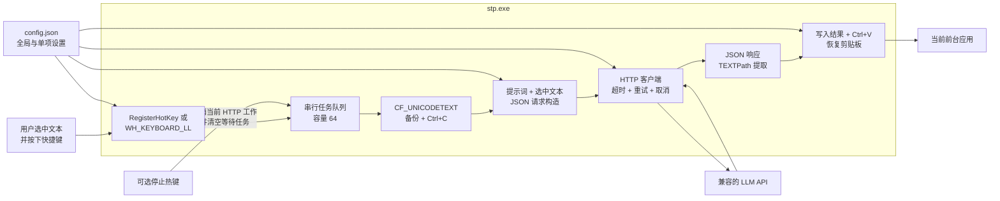
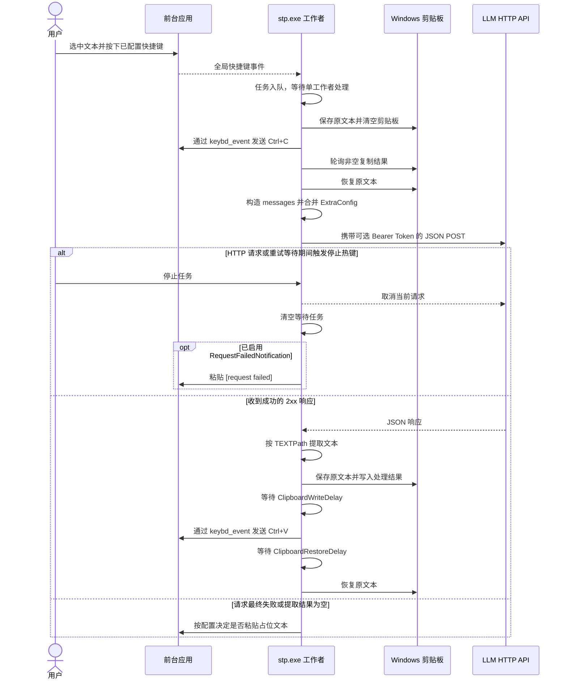

[English](README.md) | 简体中文

# STP for Windows

STP for Windows 是一个面向 Windows x86_64 的后台选中文本处理客户端。它把全局快捷键变成可配置的 LLM 文本操作：在任意应用中选中文本并按下快捷键后，STP 会复制选区，把选中文本和对应提示词发送到兼容的 JSON HTTP 接口，从响应中提取结果，粘贴回当前输入位置，并尝试恢复原剪贴板文本。

`stp.exe`：使用原生 Win32 热键、剪贴板 API 和键盘事件的便携式命令行后台程序。

## 功能特性

- **可配置的文本操作**
  - 可以定义任意数量的 `HotKeyConfig` 条目，每项拥有独立的提示词、快捷键和可选请求覆盖。
  - 适合翻译、润色、总结、格式转换、信息提取和代码辅助等场景。
- **两套全局快捷键后端**
  - 可以使用 Windows `RegisterHotKey`，也可以切换到 `WH_KEYBOARD_LL` 低级键盘钩子。
  - 支持常用修饰键、字母、数字、功能键、导航键和数字键盘别名。
- **通用 LLM JSON 接口**
  - 发送 JSON `POST` 请求，把操作提示词作为 `developer` 消息，把选中文本作为 `user` 消息。
  - 支持 Bearer Token、模型、温度、Token 上限、任意扩展字段和可配置响应路径。
- **按操作覆盖接口与请求字段**
  - 单条热键配置可以为当前任务覆盖 `APIEndpoint`、`Token` 和 `TEXTPath`。
  - 单条 `ExtraConfig` 的优先级高于全局 `ExtraConfig` 和内置请求字段。
- **串行任务队列与取消**
  - 单工作者按触发顺序处理任务，等待队列容量为 64。
  - 可选停止热键会取消当前 HTTP 请求或重试等待并清空队列，但不会退出 STP。
- **尽量保留剪贴板的原位替换**
  - 保存原有 Unicode 剪贴板文本，通过 Win32 `keybd_event` 发送 `Ctrl+C` 和 `Ctrl+V`，每次操作后尝试恢复原文本。
  - 可以调整复制超时和粘贴前后的等待时间，以兼容响应较慢的应用。
- **网络控制与诊断**
  - 支持单次请求超时、指数退避重试、HTTP/2 协商、TLS 证书校验开关和调试日志。
  - 可以在失败或提取结果为空时粘贴 `[request failed]` 或 `[empty result]`。

## 下载

| 平台 | 下载 | SHA-256 |
|---|---|---|
| Windows x86_64 | [stp-windows-amd64.zip](https://github.com/Joey-Kot/STP-for-Windows/releases/download/Latest/stp-windows-amd64.zip) | [sha256](https://github.com/Joey-Kot/STP-for-Windows/releases/download/Latest/stp-windows-amd64.zip.sha256) |

## 架构



## 处理流程



STP 不会并行发送多个请求。所有热键任务都按队列顺序逐个处理。

## 功能范围与当前限制

- 正式 Release 只提供 Windows x86_64 版本。虽然非 Windows 构建可用于测试，但剪贴板、按键模拟和全局热键只在 Windows 上可用。
- STP 是控制台后台程序，不提供 GUI、系统托盘、Windows Toast 通知或逐字符输入模式。
- 目标应用必须支持普通 `Ctrl+C` 和 `Ctrl+V`，并能通过 `CF_UNICODETEXT` 提供复制文本。
- 程序只备份和恢复 Unicode 文本格式。图片、文件列表、富文本、HTML 和其他剪贴板格式不会保留。
- 任务轮到工作者处理后，选中文本和提示词才会发送到 API。项目不包含本地模型或离线处理后端。
- 接口必须接收 JSON 并返回 JSON；非 JSON 响应无法提取文本。
- 请求期间切换前台窗口，会改变最终 `Ctrl+V` 的目标应用。
- 停止热键只取消 HTTP 请求和重试等待，不能中断已经开始的剪贴板复制或粘贴。
- 按住快捷键可能产生重复任务事件。热键事件通道或任务队列已满时，突发事件可能被丢弃。
- `RequestFailedNotification` 不是 Windows 通知开关，它只控制是否向前台应用粘贴占位文本。

## 运行要求

- Windows 10 或 Windows 11 x86_64。
- 一个能够接收所生成 JSON 请求并返回 JSON 的兼容 LLM HTTP 接口。
- 一个可以正常使用 `Ctrl+C` 和 `Ctrl+V` 的目标应用。

## 快速开始

1. 下载并解压 `stp-windows-amd64.zip`。
2. 在解压目录打开 PowerShell，运行：

```powershell
.\stp.exe
```

3. 如果当前目录没有 `config.json`，并且没有提供命令行覆盖参数，STP 会创建默认 `config.json` 后退出。
4. 编辑生成的配置。至少需要填写接口地址，并在一个 `HotKeyConfig` 条目中同时配置非空的 `Prompt` 和 `HotKey`。
5. 重新启动 STP：

```powershell
.\stp.exe --config .\config.json
```

6. 在编辑器、浏览器、聊天软件或其他目标窗口中选中文本，然后按下对应的任务快捷键。
7. 请求完成前保持目标输入位置处于前台。需要退出时，在 STP 控制台中按 `Ctrl+C`。

### 最小配置示例

```json
{
  "APIEndpoint": "https://api.example.com/v1/chat/completions",
  "Token": "sk-xxx",
  "Model": "your-model",
  "TEXTPath": "choices[0].message.content",
  "RequestTimeout": 30,
  "MaxRetry": 3,
  "RetryBaseDelay": 0.5,
  "EnableHTTP2": true,
  "VerifySSL": true,
  "ClipboardTimeout": 1000,
  "ClipboardWriteDelay": 80,
  "ClipboardRestoreDelay": 120,
  "RequestFailedNotification": true,
  "StopTaskHotkey": "alt+f12",
  "HotKeyConfig": [
    {
      "Prompt": "将以下文本翻译成简体中文，只输出翻译结果。",
      "HotKey": "ctrl+f1",
      "ExtraConfig": ""
    },
    {
      "Prompt": "将以下文本改写得简洁、自然，只输出改写结果。",
      "HotKey": "ctrl+f2",
      "ExtraConfig": "{\"temperature\":0.2}"
    }
  ],
  "HotKeyHook": false,
  "DEBUG": false
}
```

这只是协议示例。请按所使用服务的要求填写接口、模型、Token、请求字段和响应路径。

### 隐藏控制台窗口运行

先在普通控制台中确认配置正确，再通过 PowerShell 隐藏启动：

```powershell
Start-Process `
  -FilePath "C:\Tools\stp\stp.exe" `
  -ArgumentList "--config", "C:\Tools\stp\config.json" `
  -WindowStyle Hidden
```

如果需要登录后自动运行，可以使用 Windows 任务计划程序或其他启动管理方式。

## 配置查找与优先级

配置优先级为：

```text
命令行覆盖参数 > --config 指定的 JSON > 当前目录 config.json > 默认值
```

- 提供 `--config <PATH>` 时，STP 先加载指定文件，再应用命令行中明确出现的覆盖参数。
- 没有 `--config` 时，如果当前目录存在 `config.json`，程序会加载该文件。
- 没有配置文件但提供了任意覆盖参数时，程序从内置默认值开始运行。
- 配置文件和覆盖参数都不存在时，程序创建默认 `config.json`、打印提示并以成功状态退出。
- 命令行参数不能创建 `HotKeyConfig` 条目或提示词；至少一个有效的提示词与快捷键组合仍需来自配置文件。
- 缺失的普通字段和设为 `null` 的普通字段保留默认值，未知字段会被忽略。
- `HotKeyConfig: null` 会清空热键数组；数组中的 `null` 项会变成全空条目。
- JSON 语法错误或字段类型不匹配属于配置错误。

## 配置字段

### API 与请求字段

| 字段 | 类型 | 默认值 | 行为 |
|---|---|---:|---|
| `APIEndpoint` | string | `""` | 请求使用的 HTTP 接口；任务真正发出请求时不能为空 |
| `Token` | string | `""` | 非空时发送 `Authorization: Bearer <token>` |
| `Model` | string | `""` | 非空时加入根级 `model` 请求字段 |
| `Temperature` | number | `0.0` | 合并 `ExtraConfig` 前加入根级 `temperature` 字段 |
| `Max_Tokens` | integer | `0` | 大于零时才加入 `max_tokens` |
| `TEXTPath` | string | `"choices[0].message.content"` | 从响应 JSON 提取结果的默认点分路径 |
| `ExtraConfig` | string | `""` | 合并到每次请求中的字符串化 JSON 对象 |

### 网络字段

| 字段 | 类型 | 默认值 | 行为 |
|---|---|---:|---|
| `RequestTimeout` | integer | `30` | 单次完整请求的超时秒数；非正值表示不设置主动超时 |
| `MaxRetry` | integer | `3` | 总尝试次数，包含第一次；小于 1 时仍会尝试一次 |
| `RetryBaseDelay` | number | `0.5` | 第一次重试前的等待秒数，之后每次翻倍；负值或非有限值按零处理 |
| `EnableHTTP2` | boolean | `true` | 开启时允许 HTTP/2 协商，关闭时强制使用 HTTP/1.x |
| `VerifySSL` | boolean | `true` | 是否校验 TLS 证书；关闭后会接受无效证书 |

### 快捷键、剪贴板、输出与调试字段

| 字段 | 类型 | 默认值 | 行为 |
|---|---|---:|---|
| `ClipboardTimeout` | integer | `1000` | 等待非空复制结果的最长毫秒数；负值按零处理 |
| `ClipboardWriteDelay` | integer | `80` | 写入处理结果后、发送 `Ctrl+V` 前的等待毫秒数；负值按零处理 |
| `ClipboardRestoreDelay` | integer | `120` | 发送 `Ctrl+V` 后、恢复原剪贴板前的等待毫秒数；负值按零处理 |
| `RequestFailedNotification` | boolean | `false` | 请求失败或取消时粘贴 `[request failed]`，提取为空时粘贴 `[empty result]` |
| `StopTaskHotkey` | string | `""` | 可选停止热键，用于取消当前 HTTP 工作并清空队列 |
| `HotKeyConfig` | array | 10 项 | 任务配置；前八项默认热键为 `ctrl+f1` 至 `ctrl+f8`，但所有默认提示词都为空 |
| `HotKeyHook` | boolean | `false` | 为 true 时使用 `WH_KEYBOARD_LL`，为 false 时使用 `RegisterHotKey` |
| `DEBUG` | boolean | `false` | 输出请求、队列、复制、粘贴等诊断错误 |

### `HotKeyConfig` 条目字段

| 字段 | 类型 | 默认值 | 行为 |
|---|---|---:|---|
| `Prompt` | string | `""` | 作为本操作的 `developer` 消息发送 |
| `HotKey` | string | `""` | 触发本操作的全局快捷键 |
| `ExtraConfig` | string | `""` | 在全局 `ExtraConfig` 之后合并的字符串化 JSON 对象，也可以提供当前任务的运行时覆盖 |

只有 `Prompt` 和 `HotKey` 都不为空的条目才会注册。任务 ID 使用该条目在数组中的 1 基位置。

## 命令行参数

运行内置帮助可以查看权威参数列表：

```powershell
.\stp.exe --help
```

### General

| 参数 | 用途 |
|---|---|
| `--config <PATH>` | 指定 JSON 配置文件 |

### API

| 参数 | 用途 |
|---|---|
| `--api-endpoint <URL>` | 覆盖 LLM HTTP 接口 |
| `--token <TOKEN>` | 覆盖 Bearer Token |
| `--model <MODEL>` | 覆盖模型字段 |
| `--temperature <VALUE>` | 覆盖温度字段 |
| `--max-tokens <N>` | 覆盖最大 Token 字段；非正值不会加入请求 |
| `--text-path <PATH>` | 覆盖响应提取路径 |
| `--extra-config <JSON>` | 覆盖全局字符串化扩展 JSON 对象 |

### Network

| 参数 | 用途 |
|---|---|
| `--request-timeout <SECONDS>` | 覆盖单次请求超时 |
| `--max-retry <N>` | 覆盖请求总尝试次数 |
| `--retry-base-delay <SECONDS>` | 覆盖指数退避初始等待 |
| `--enable-http2 <BOOL>` | 启用或禁用 HTTP/2 协商 |
| `--verify-ssl <BOOL>` | 启用或禁用 TLS 证书校验 |

### Hotkeys

| 参数 | 用途 |
|---|---|
| `--stop-task-hotkey <HOTKEY>` | 覆盖停止热键 |
| `--hotkey-hook <BOOL>` | 选择低级键盘钩子或 `RegisterHotKey` |
| `--clipboard-timeout <MS>` | 覆盖选中文本复制超时 |
| `--clipboard-write-delay <MS>` | 覆盖写入处理结果后、发送 `Ctrl+V` 前的等待时间 |
| `--clipboard-restore-delay <MS>` | 覆盖发送 `Ctrl+V` 后、恢复原剪贴板前的等待时间 |

### Output

| 参数 | 用途 |
|---|---|
| `--request-failed-notification <BOOL>` | 启用或禁用失败和空结果占位文本 |

### Debug

| 参数 | 用途 |
|---|---|
| `--debug <BOOL>` | 启用或禁用诊断日志 |

使用 `-h` 或 `--help` 查看帮助，使用 `-V` 或 `--version` 查看版本。长参数只使用标准双横线形式，布尔参数必须显式传值：

```text
--verify-ssl false
--enable-http2=true
--hotkey-hook false
```

参数解析失败返回退出码 `2`；配置和运行错误返回 `1`；帮助、版本、正常退出和首次创建默认配置返回 `0`。

## 请求结构与 `ExtraConfig`

每个任务会先构造以下请求结构：

```json
{
  "model": "example-model",
  "messages": [
    {
      "role": "developer",
      "content": "<HotKeyConfig.Prompt>"
    },
    {
      "role": "user",
      "content": "<选中文本>"
    }
  ],
  "max_tokens": 32768,
  "temperature": 0.0
}
```

`Model` 为空时不会加入 `model`，`Max_Tokens` 非正时不会加入 `max_tokens`；上面的示例值只用于说明它们在 JSON 中的类型。

`ExtraConfig` 本身是一个 JSON 字符串，解码后的内容必须是对象或 `null`：

```json
{
  "ExtraConfig": "{\"max_tokens\":null,\"max_completion_tokens\":32768,\"reasoning_effort\":\"minimal\"}"
}
```

合并与清理顺序：

1. 先创建内置字段。
2. 全局 `ExtraConfig` 覆盖内置字段。
3. 当前 `HotKeyConfig` 条目的 `ExtraConfig` 再覆盖前两者。
4. 递归删除 `null`、只含空白的字符串，以及清理后为空的对象和数组。
5. 保留数字零和布尔值 `false`。

因此可以用扩展配置添加服务商专用字段、覆盖内置字段，或通过 `null` 删除不需要的字段。

全局 `ExtraConfig` 非法时程序无法启动。单条热键的 `ExtraConfig` 非法时，只会忽略该任务的扩展配置，并且仅在 `DEBUG=true` 时输出诊断信息。

### 单项运行时覆盖

只有单条热键的 `ExtraConfig` 会把以下大小写完全一致的键解释为运行时设置：

| 键 | 运行时行为 |
|---|---|
| `APIEndpoint` | 当前任务使用不同的接口地址 |
| `Token` | 当前任务使用不同的 Bearer Token |
| `TEXTPath` | 当前任务使用不同的响应提取路径 |

它们的值必须是字符串。提取后，这三个键会从请求体中删除；空字符串会回退到全局配置。全局 `ExtraConfig` 中的同名键仍是普通请求字段，不会改变运行时路由。

示例：

```json
{
  "Prompt": "总结以下文本。",
  "HotKey": "ctrl+f3",
  "ExtraConfig": "{\"APIEndpoint\":\"https://api.example.com/v1/chat/completions\",\"Token\":\"task-token\",\"TEXTPath\":\"choices[0].message.content\",\"model\":\"task-model\"}"
}
```

## 响应文本提取

`TEXTPath` 使用点号分隔对象字段，并支持在每个字段后使用一个或多个数组索引：

```text
choices[0].message.content
results[0].alternatives[0].transcript
data.items[0][1].text
```

字符串、数字和布尔值会转换为文本；对象、数组和 `null` 不能作为最终结果。

配置路径无法取得值时，STP 依次尝试：

1. 顶层字符串字段 `text`。
2. 任意一个非空顶层字符串字段。
3. 空结果。

非 JSON 响应或无法使用的 JSON 值会产生空结果。`RequestFailedNotification=true` 时粘贴 `[empty result]`，否则保持静默。

## 快捷键、任务队列与停止行为

支持的修饰键别名：

- `alt`、`menu`
- `ctrl`、`control`
- `shift`
- `win`、`meta`、`super`

支持的主键包括：

- 字母 `A`–`Z` 和顶排数字 `0`–`9`。
- 功能键 `F1`–`F24`。
- `Esc`、`Space`、`Enter`、`Tab`、`Backspace`、`Insert`、`Delete`、`Home`、`End`、`PageUp` 和 `PageDown`。
- 方向键 `Left`、`Up`、`Right` 和 `Down`。
- `numpad1`、`num1`、`kp1`、`add`、`plus`、`subtract`、`minus` 等数字键盘别名。

快捷键不区分大小写。为保持旧配置兼容，最终主键之前无法识别的修饰 token 会被忽略；最终主键不受支持时会报错。

两种后端的行为：

- `HotKeyHook=false` 时，在专用 Windows 消息线程上使用 `RegisterHotKey`。
- `HotKeyHook=true` 时使用 `WH_KEYBOARD_LL`，忽略注入的键盘事件，允许同时按住额外修饰键，并阻止匹配主键的按下和释放继续传递到其他应用。
- 两种后端都不会额外实现长按去重。

任务行为：

- 应用队列最多保存 64 个任务 ID，由一个工作者串行处理。
- 队列已满时，新任务会直接丢弃，不会阻塞键盘回调。
- `StopTaskHotkey` 会取消当前 HTTP 请求或退避等待，并清空应用队列中尚未处理的任务。
- `RequestFailedNotification=true` 时，取消当前请求会进入请求错误流程，可能粘贴 `[request failed]`。
- 停止操作不会退出 STP，之后仍可继续触发普通任务快捷键。
- 关闭 STP 时会取消当前 HTTP 工作、清空队列、释放注册热键或键盘钩子，并等待工作者结束。

## 剪贴板与自动替换

STP 只使用 Windows `CF_UNICODETEXT` 剪贴板格式。

复制流程：

1. 读取并保存当前剪贴板文本。
2. 最多尝试五次把剪贴板文本改为空字符串。
3. 等待 50 ms，通过 `keybd_event` 发送 `Ctrl+C`。
4. 每 50 ms 轮询一次非空文本，直到 `ClipboardTimeout` 到期。
5. 等待 150 ms，最多尝试五次恢复原剪贴板文本。

粘贴流程：

1. 读取并保存当前剪贴板文本。
2. 最多尝试五次写入处理结果。
3. 等待 `ClipboardWriteDelay` 毫秒，默认值为 80。
4. 通过 `keybd_event` 发送 `Ctrl+V`。
5. 等待 `ClipboardRestoreDelay` 毫秒，默认值为 120。
6. 最多尝试五次恢复原剪贴板文本。

剪贴板写入重试之间等待 50 ms；`OpenClipboard` 本身会在大约一秒内持续重试。

项目明确使用 `keybd_event`，不使用 `SendInput`。部分应用、管理员权限窗口、远程会话、安全软件或剪贴板管理器可能阻止模拟按键或剪贴板访问。如果替换不稳定，可以适当增大两个剪贴板延迟，并先在记事本等简单应用中测试。

## HTTP、重试与取消

- 请求使用 `POST`、`Content-Type: application/json` 和 `User-Agent: clip-hotkey-client/1.0`。
- Token 非空时发送 `Authorization: Bearer <token>`。
- 任意 HTTP `2xx` 状态都视为成功；其他最终状态会把状态码和完整响应正文写入请求错误。
- `MaxRetry` 表示总尝试次数，不是第一次请求之外的重试次数。
- 退避从 `RetryBaseDelay` 开始，每次失败后翻倍。
- HTTP 请求和重试等待可以立即取消；剪贴板操作是阻塞流程，不受取消令牌控制。
- `RequestTimeout` 覆盖一次完整尝试，包括重定向和响应正文读取。
- 客户端不使用环境变量或系统代理配置。
- 启用 gzip 响应解压，默认不启用 Brotli 和 Zstandard。
- 重定向由程序显式处理：`301`、`302`、`303` 会改为无正文 `GET`，`307`、`308` 保留原方法和 JSON 请求体。
- 授权头只会保留到原始域名或其子域。一旦重定向离开该域名范围，后续请求不再携带授权头。
- 关闭 `EnableHTTP2` 会强制 HTTP/1.x；开启时按常规方式协商协议。

## 从源码构建

项目使用 Rust Edition 2024，建议使用当前稳定版 Rust 工具链。

### 在 Windows 上构建

```powershell
cargo build --locked --release --bin stp
```

产物：

```text
target\release\stp.exe
```

### 在 Ubuntu 上交叉编译

安装 Windows GNU 目标和 MinGW-w64：

```bash
rustup target add x86_64-pc-windows-gnu
sudo apt-get update
sudo apt-get install --yes mingw-w64
```

构建：

```bash
cargo build --locked --release \
  --target x86_64-pc-windows-gnu \
  --bin stp
```

产物：

```text
target/x86_64-pc-windows-gnu/release/stp.exe
```

### 测试与静态检查

```bash
cargo fmt --all -- --check
cargo clippy --locked --all-targets -- -D warnings
cargo test --locked --all-targets
cargo clippy --locked \
  --target x86_64-pc-windows-gnu \
  --all-targets -- -D warnings
cargo check --locked \
  --target x86_64-pc-windows-gnu \
  --all-targets
```

GitHub Actions 会执行这些检查、构建 `stp.exe`、确认程序没有导入 `SendInput` 或意外的 MinGW 运行时 DLL、生成 Rust 依赖许可证材料，并更新 `Latest` Release。

## 安全与隐私

- 选中文本、提示词和合并后的请求字段都会发送到配置的接口。只应使用你愿意向其提供这些内容的服务。
- `Token` 和单项任务 Token 都以明文保存在 `config.json` 中。
- 公网 HTTPS 服务应保持 `VerifySSL=true`。设为 `false` 后会接受无效证书，可能遭受中间人攻击。
- `DEBUG=true` 可能输出接口信息和包含敏感内容的错误响应正文。
- 客户端绕过系统代理设置。如需代理，应在可信网关或接口侧完成路由。
- 剪贴板备份和恢复只处理文本，并且属于尽力而为；敏感剪贴板文本会暂时保存在进程内存中。
- 自动粘贴会发送到结果就绪时处于前台的应用。

## 实现约束

- 全局快捷键使用 `RegisterHotKey` 或 `WH_KEYBOARD_LL`。
- 剪贴板使用 Win32 `CF_UNICODETEXT` API。
- 复制和粘贴使用 `keybd_event`，明确禁止使用 `SendInput`。
- 请求为 JSON，不使用 multipart，也不支持流式处理。
- 所有任务通过一个有界队列和一个工作者执行。
- 项目不包含 GUI、系统托盘、Windows 通知、本地模型或外部辅助程序。

## 仓库布局

| 路径 | 作用 |
|---|---|
| `src/config.rs` | JSON 兼容、默认值、CLI 解析和覆盖优先级 |
| `src/app.rs` | 任务队列、工作者、取消、请求编排和占位输出 |
| `src/hotkey/` | 快捷键解析、`RegisterHotKey` 和低级键盘钩子后端 |
| `src/clipboard.rs` | Unicode 剪贴板复制、粘贴、重试与恢复流程 |
| `src/keyboard.rs` | 兼容 `keybd_event` 行为的 `Ctrl+C` 和 `Ctrl+V` 模拟 |
| `src/request.rs` | 请求构造和 `ExtraConfig` 合并 |
| `src/response.rs` | `TEXTPath` 解析和响应文本提取 |
| `src/netclient.rs` | HTTP、重定向、超时、重试、TLS 与取消 |
| `tests/` | 跨平台兼容测试和黄金数据 |
| `docs/rust-rewrite-contract.md` | 冻结的兼容契约和 Windows 人工验收项目 |
| `.github/workflows/latest-release.yml` | 验证、Windows 交叉构建、打包和 `Latest` Release 发布 |

## 第三方组件

Rust 依赖图由 `Cargo.lock` 锁定。Release 会在 `THIRD_PARTY_LICENSES/RUST-DEPENDENCIES.html` 中附带自动生成的依赖许可证详情，并保留 `micmonay/keybd_event` v1.1.2 兼容实现的许可证说明。

详情见 [THIRD_PARTY_NOTICES.txt](THIRD_PARTY_NOTICES.txt) 和 [`THIRD_PARTY_LICENSES/`](THIRD_PARTY_LICENSES/)。

## 许可证

本项目使用 [GNU General Public License v3.0 or later](LICENSE)。

Copyright © 2026 Joey Kot <joey.kot.x@gmail.com>
